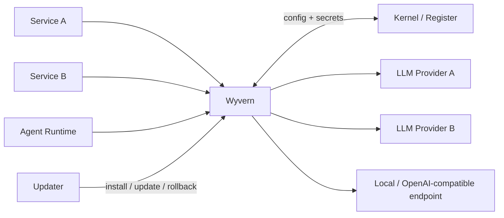
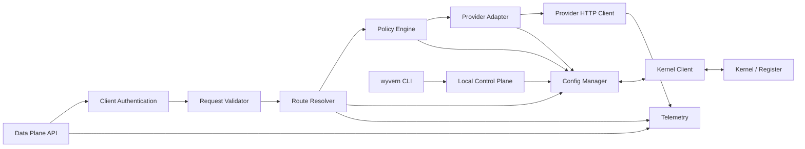

# Wyvern

> Исходный архитектурный черновик. Решения владельца от 19 сентября 2026 года и актуальный план дальнейшей разработки находятся в [плане интеграции v0.2](wyvern-integration-plan-v0.2.md). Разделы о главной сущности, установке, интерфейсах и Kernel/Volt необходимо переработать по этому плану; описанное ниже не является реализованным контрактом.

**Статус:** Draft / Architecture & Technical Specification v0.1  
**Проект:** Exocortex  
**Тип:** внутренний инфраструктурный сервис  
**Назначение:** единый gateway между сервисами Exocortex и внешними/локальными LLM API  
**Интерфейс управления:** CLI only  
**Источник конфигурации и секретов:** Kernel / Register  
**Обновление:** через Updater

---

## 1. Определение

**Wyvern** — единая контролируемая точка выхода сервисов Exocortex к большим языковым моделям.

Ни один внутренний сервис не должен напрямую хранить API-ключ конкретного LLM-провайдера, знать его endpoint или быть жестко связан с конкретным именем модели. Вместо этого сервис отправляет запрос в Wyvern, указывая логический маршрут, например `reasoning.default` или `text.fast`.

Wyvern:

1. идентифицирует вызывающий сервис;
2. валидирует запрос;
3. получает или использует актуальную конфигурацию из Kernel;
4. разрешает логический маршрут в конкретную связку `provider + model + endpoint + credential + policy`;
5. переводит внутренний формат запроса в формат конкретного LLM API;
6. выполняет запрос;
7. нормализует ответ;
8. возвращает ответ вызывающему сервису;
9. записывает техническую телеметрию, usage, ошибки и факт маршрутизации.

Wyvern не является агентом, системой памяти, task runtime или orchestration engine. Это специализированный LLM gateway.

---

## 2. Основная идея

Внутренний сервис должен зависеть только от стабильного API Wyvern.

```text
Service -> Wyvern -> Provider API
             |
             +-> Kernel / Register
             |
             +-> telemetry / logs
```

Сервис не должен знать:

- какой внешний LLM-провайдер используется;
- какой API endpoint используется;
- какой API key используется;
- какое фактическое имя модели используется у провайдера;
- был ли применен fallback;
- как устроена аутентификация у провайдера;
- как выглядит provider-specific HTTP API.

Это позволяет заменить внешний API без изменения клиентского сервиса.

Пример:

```text
Mastermind -> route=reasoning.default -> Wyvern

Сегодня:
reasoning.default -> provider-a -> model-x

Завтра:
reasoning.default -> provider-b -> model-y
```

Для Mastermind контракт при этом не меняется.

---

## 3. Цели проекта

Wyvern должен обеспечить:

1. **Единую точку LLM-доступа** для всей системы Exocortex.
2. **Централизованное хранение конфигурации** через Kernel / Register.
3. **Централизованное хранение LLM credentials** через Kernel / Register.
4. **Отвязку сервисов от конкретных LLM-провайдеров.**
5. **Стабильный внутренний протокол**, не зависящий от внешних API.
6. **Маршрутизацию через логические route names.**
7. **Fallback между моделями**, если он явно разрешен конфигурацией.
8. **Единый timeout/retry/circuit-breaker слой.**
9. **Единый usage и cost accounting.**
10. **Прозрачную диагностику каждого LLM-запроса.**
11. **Безопасную работу с секретами.**
12. **Поддержку streaming.**
13. **Поддержку tool calls без исполнения инструментов внутри Wyvern.**
14. **CLI-only управление.**
15. **Совместимость с централизованным Updater.**
16. **Безопасное обновление конфигурации без остановки сервиса.**
17. **Возможность добавлять новых LLM-провайдеров отдельными адаптерами.**

---

## 4. Что Wyvern не делает

Следующие функции сознательно находятся вне зоны ответственности Wyvern.

### 4.1. Wyvern не управляет диалогами

Он не хранит историю чатов и не собирает context window.

Историю передает вызывающий сервис.

### 4.2. Wyvern не является памятью

Он не хранит memories, embeddings, документы, knowledge base и пользовательские профили.

### 4.3. Wyvern не является agent runtime

Он не принимает долгоживущие задачи и не решает, когда повторно вызвать модель.

### 4.4. Wyvern не исполняет tool calls

Если LLM вернула вызов инструмента, Wyvern нормализует его и отдает вызывающему сервису.

Исполнение инструмента выполняет агент или другой доменный сервис.

### 4.5. Wyvern не управляет prompts

Prompt templates и бизнес-логика prompt construction принадлежат вызывающему сервису.

### 4.6. Wyvern не имеет Web UI

Все операции выполняются через CLI и системные API.

### 4.7. Wyvern не заменяет Kernel

Kernel остается source of truth для конфигурации и секретов Wyvern.

### 4.8. Wyvern не заменяет Updater

Wyvern предоставляет Updater необходимые команды и health interfaces, но не обновляет себя самостоятельно.

---

# 5. Архитектура

## 5.1. Общая схема



## 5.2. Внутренняя схема Wyvern



---

# 6. Ключевые сущности

Все термины ниже являются частью контрактной модели проекта.

## 6.1. Provider

**Provider** — описание конкретного внешнего или локального LLM API.

Provider содержит:

- уникальный `provider_id`;
- тип адаптера;
- base URL;
- схему аутентификации;
- ссылку на credential;
- provider-level timeout;
- rate-limit параметры, если они задаются локально;
- TLS-настройки;
- состояние `enabled/disabled`.

Пример:

```yaml
provider_id: primary-cloud
adapter: openai-compatible
base_url: https://llm.example.invalid/v1
credential_ref: wyvern/secrets/primary-cloud
request_timeout_ms: 120000
enabled: true
```

`provider_id` является внутренним идентификатором Exocortex и не обязан совпадать с названием компании-провайдера.

---

## 6.2. Credential

**Credential** — секретные данные, необходимые для аутентификации у Provider.

Credential хранится в Kernel / Register.

Wyvern получает credential через Kernel API и держит его только в оперативной памяти процесса.

Credential не должен:

- передаваться вызывающему сервису;
- выводиться в CLI;
- попадать в логи;
- попадать в crash dump;
- храниться в plaintext local config;
- передаваться через command-line argument.

Секреты в CLI принимаются через `stdin` или безопасный secret input.

---

## 6.3. Model

**Model** — конкретная модель на конкретном Provider.

Model содержит:

- внутренний `model_id`;
- ссылку на `provider_id`;
- реальное provider-side имя модели;
- capabilities;
- optional provider-specific limits;
- pricing metadata;
- состояние `enabled/disabled`.

Пример:

```yaml
model_id: reasoning-primary
provider_id: primary-cloud
remote_model: provider-model-name
capabilities:
  - text
  - streaming
  - tools
  - structured_output
max_input_tokens: 200000
max_output_tokens: 32000
enabled: true
```

Внутренние сервисы не должны напрямую использовать `remote_model`.

---

## 6.4. Route

**Route** — стабильное логическое имя, используемое клиентскими сервисами.

Примеры:

```text
reasoning.default
reasoning.deep
text.fast
coding.default
summarization.fast
```

Route определяет:

- primary model;
- optional fallback models;
- policy;
- allowed clients;
- required capabilities;
- ограничения на параметры запроса.

Пример:

```yaml
route_id: reasoning.default
primary: reasoning-primary
fallbacks:
  - reasoning-secondary
policy_id: default-reasoning
required_capabilities:
  - text
  - streaming
```

Именно Route является рекомендуемым публичным контрактом между сервисами Exocortex и Wyvern.

---

## 6.5. Policy

**Policy** — набор ограничений и правил выполнения запроса.

Policy может задавать:

- timeout;
- maximum input size;
- maximum output tokens;
- разрешен ли streaming;
- разрешены ли tools;
- разрешен ли structured output;
- retry policy;
- fallback policy;
- concurrency limit;
- per-client limit;
- cost budget;
- request body logging policy;
- permitted callers.

Пример:

```yaml
policy_id: default-reasoning
request_timeout_ms: 120000
max_output_tokens: 16000
allow_streaming: true
allow_tools: true
allow_structured_output: true
retry:
  max_attempts: 2
fallback:
  enabled: true
```

---

## 6.6. Request

**Request** — один входящий вызов Wyvern.

Каждый Request получает глобально уникальный `request_id`.

Request может породить несколько **Attempt**, если были retry или fallback.

---

## 6.7. Attempt

**Attempt** — одна фактическая попытка обращения к конкретной модели конкретного provider.

Пример:

```text
request_id = req_123

attempt 1 -> reasoning-primary -> provider timeout
attempt 2 -> reasoning-secondary -> success
```

Это различие обязательно для корректного аудита и usage accounting.

---

## 6.8. Config Revision

Каждая полная конфигурация Wyvern должна иметь `revision`.

Wyvern всегда работает на одной атомарной revision.

Нельзя допускать состояние, при котором часть новых Provider уже загружена, а Route еще относится к старой конфигурации.

---

# 7. Kernel как source of truth

## 7.1. Что хранится в Kernel

В Register должен существовать отдельный namespace Wyvern.

Логическая структура:

```text
wyvern/
  runtime/
  providers/
  models/
  routes/
  policies/
  clients/
  secrets/
```

Рекомендуемые сущности:

```text
wyvern/runtime
wyvern/providers/<provider_id>
wyvern/models/<model_id>
wyvern/routes/<route_id>
wyvern/policies/<policy_id>
wyvern/clients/<client_id>
wyvern/secrets/<credential_id>
```

Фактические HTTP paths должны соответствовать уже принятому Register API Kernel. Wyvern не должен создавать параллельную систему конфигурации.

---

## 7.2. Bootstrap-конфигурация

Есть одно неизбежное исключение из правила «вся конфигурация находится в Kernel»: Wyvern должен знать, как подключиться к самому Kernel.

Локальный bootstrap должен содержать только:

- Kernel endpoint;
- параметры аутентификации к Kernel или ссылку на локальный machine credential;
- optional bind/bootstrap network settings, если они нужны до получения основной конфигурации.

Пример:

```toml
[kernel]
endpoint = "https://kernel.internal"
credential_file = "/run/secrets/wyvern-kernel.token"
```

В bootstrap запрещено хранить credentials LLM-провайдеров.

---

## 7.3. Загрузка конфигурации

При старте Wyvern выполняет:

```text
1. Load bootstrap
2. Connect to Kernel
3. Authenticate
4. Fetch Wyvern config snapshot
5. Fetch referenced credentials
6. Validate full dependency graph
7. Compile runtime configuration
8. Atomically activate revision
9. Start readiness
```

Если начальная конфигурация невалидна, Wyvern не должен переходить в `ready`.

---

## 7.4. Live reload

Wyvern должен поддерживать reload без restart процесса.

Алгоритм:

```text
Kernel revision changed
        |
        v
Fetch complete new snapshot
        |
        v
Validate schema
        |
        v
Validate references
        |
        v
Validate provider/model capabilities
        |
        v
Compile immutable runtime snapshot
        |
        v
Atomic pointer swap
        |
        v
New requests use new revision
Existing requests finish on old revision
```

Если новая revision невалидна:

- она не активируется;
- текущая рабочая revision остается активной;
- событие записывается в журнал;
- health status переходит в `degraded`, если это требуется;
- CLI показывает причину ошибки.

Это является обязательным last-known-good поведением.

---

## 7.5. Поведение при недоступности Kernel

### Cold start

Если Wyvern только запускается и не может получить валидную конфигурацию из Kernel, readiness остается `false`.

### Уже работающий процесс

Если Kernel временно недоступен, Wyvern продолжает работать на последней валидной конфигурации, находящейся в памяти.

При этом:

- статус должен показывать `kernel: unavailable`;
- текущая revision остается видимой;
- новые изменения конфигурации не применяются;
- provider credentials не сбрасываются из памяти только из-за временной потери Kernel.

После восстановления Kernel выполняется обычная проверка revision и transactional reload.

Wyvern не должен сохранять provider secrets на диск для восстановления после cold start.

---

# 8. Внешний Data Plane API

## 8.1. Принцип

Все внутренние сервисы используют стабильный Wyvern API.

Provider-specific API наружу не прокидывается.

Первая версия должна поддерживать минимум:

- обычную text generation;
- multi-turn message input;
- streaming;
- tool definitions и tool calls;
- structured JSON output;
- usage metadata.

---

## 8.2. Endpoint генерации

```http
POST /v1/generate
```

Пример запроса:

```json
{
  "route": "reasoning.default",
  "messages": [
    {
      "role": "system",
      "content": "You are an internal Exocortex service."
    },
    {
      "role": "user",
      "content": "Analyze this document."
    }
  ],
  "options": {
    "max_output_tokens": 4000,
    "temperature": 0.2
  },
  "metadata": {
    "task_id": "task_123"
  }
}
```

Клиент указывает `route`, а не provider/model.

---

## 8.3. Нормализованный ответ

```json
{
  "request_id": "req_01J...",
  "route": "reasoning.default",
  "target": {
    "model_id": "reasoning-primary",
    "provider_id": "primary-cloud"
  },
  "output": [
    {
      "type": "message",
      "role": "assistant",
      "content": [
        {
          "type": "text",
          "text": "..."
        }
      ]
    }
  ],
  "finish_reason": "stop",
  "usage": {
    "input_tokens": 1250,
    "output_tokens": 620,
    "total_tokens": 1870
  },
  "timing": {
    "total_ms": 1840
  }
}
```

`target` нужен для прозрачности и диагностики внутри Exocortex. Клиент не должен строить бизнес-логику на основе конкретного `provider_id`.

---

## 8.4. Tool calls

Запрос может содержать определения tools.

```json
{
  "route": "reasoning.default",
  "messages": [
    {
      "role": "user",
      "content": "Find the document and summarize it."
    }
  ],
  "tools": [
    {
      "name": "find_document",
      "description": "Find a document by query",
      "input_schema": {
        "type": "object",
        "properties": {
          "query": {"type": "string"}
        },
        "required": ["query"]
      }
    }
  ]
}
```

Нормализованный tool call:

```json
{
  "type": "tool_call",
  "id": "call_01J...",
  "name": "find_document",
  "arguments": {
    "query": "architecture"
  }
}
```

Wyvern не вызывает `find_document` самостоятельно.

---

## 8.5. Structured output

Клиент может потребовать JSON Schema.

```json
{
  "response_format": {
    "type": "json_schema",
    "schema": {
      "type": "object",
      "properties": {
        "answer": {"type": "string"},
        "confidence": {"type": "number"}
      },
      "required": ["answer"]
    }
  }
}
```

Если выбранная модель не поддерживает capability, запрос должен быть отклонен до обращения к provider либо разрешен через совместимый fallback.

---

## 8.6. Streaming

Streaming должен использовать нормализованный поток событий, а не provider-native event format.

Рекомендуемый транспорт: SSE.

Типы событий:

```text
request.created
output.delta
tool_call.delta
usage.updated
request.completed
request.failed
```

Пример:

```text
event: output.delta
data: {"request_id":"req_...","text":"Hello"}
```

При разрыве соединения со стороны клиента Wyvern должен отменить downstream provider request, если протокол provider это позволяет.

После начала выдачи данных клиенту автоматический fallback на другую модель запрещен: смешивание двух независимых генераций в одном stream недопустимо.

---

# 9. Client Authentication

Wyvern должен точно знать, какой внутренний сервис выполняет запрос.

Идентичность нельзя принимать из произвольного `X-Service-Name` без криптографической аутентификации.

Допустимые механизмы:

- mTLS;
- service bearer token;
- другой единый механизм service authentication, принятый в Exocortex.

Результат аутентификации преобразуется во внутренний `client_id`.

`client_id` используется для:

- route permissions;
- quotas;
- usage accounting;
- audit logs;
- debugging.

Параметры доступа client -> route хранятся в Kernel.

---

# 10. Route resolution

## 10.1. Алгоритм

```text
Request
  |
  v
Authenticate client
  |
  v
Find route
  |
  v
Check client permission
  |
  v
Validate requested capabilities/options
  |
  v
Resolve primary model
  |
  v
Check provider/model enabled
  |
  v
Apply policy
  |
  v
Dispatch attempt
```

---

## 10.2. Fallback

Fallback выполняется только если он явно описан в Route/Policy.

Fallback допустим при:

- connection failure;
- provider timeout до начала streaming;
- retryable provider 5xx;
- rate limit, если policy это разрешает;
- temporarily unavailable model.

Fallback не должен применяться при:

- invalid caller request;
- authentication failure;
- policy violation;
- unsupported tool schema;
- response уже начал streaming;
- provider вернул успешный semantic response, который просто не понравился клиенту.

Fallback target обязан поддерживать требуемые capabilities.

---

# 11. Retry policy

Retry является потенциально дорогостоящей операцией и может приводить к нескольким billable requests.

Поэтому retries должны быть строго ограничены.

Разрешенные причины retry:

- DNS/connect error;
- TLS handshake transient failure;
- connection reset до получения response;
- explicitly retryable HTTP status;
- rate limit при наличии допустимого retry window;
- timeout до начала пользовательского stream.

Не retry:

- HTTP 4xx, означающий invalid request;
- malformed tool schema;
- request policy violation;
- контентная ошибка ответа;
- ошибка после частичной отдачи stream.

Каждая retry является отдельным Attempt.

---

# 12. Provider adapters

## 12.1. Назначение

Каждый внешний API реализуется отдельным adapter module.

Core Wyvern не должен содержать provider-specific branching вида:

```text
if provider == A ...
else if provider == B ...
```

Вместо этого используется общий adapter interface.

---

## 12.2. Контракт адаптера

Минимальный интерфейс:

```text
validate_provider_config()
validate_model_config()
capabilities()
translate_request()
send_request()
stream_request()
normalize_response()
normalize_stream_event()
classify_error()
extract_usage()
```

Adapter должен быть изолирован от route resolution и client policy.

---

## 12.3. Первый набор адаптеров

Для начальной реализации разумно предусмотреть:

1. `openai-compatible` — для API с совместимым протоколом;
2. native adapters для провайдеров, чьи capabilities или streaming semantics требуют отдельной реализации.

Наличие OpenAI-compatible adapter не означает, что внутренний Wyvern API должен копировать OpenAI API.

---

# 13. Error model

Wyvern должен скрывать нестабильные provider-specific ошибки за стабильной внутренней taxonomy.

Основные error codes:

```text
invalid_request
authentication_failed
permission_denied
route_not_found
route_disabled
capability_not_supported
quota_exceeded
rate_limited
provider_unavailable
provider_timeout
provider_rejected_request
provider_response_invalid
kernel_unavailable
configuration_invalid
internal_error
```

Пример ответа:

```json
{
  "error": {
    "code": "provider_timeout",
    "message": "LLM provider did not respond before the configured deadline.",
    "request_id": "req_01J...",
    "retryable": true
  }
}
```

Provider response body не должен бесконтрольно возвращаться клиенту, так как он может содержать внутренние детали.

---

# 14. Timeouts, cancellation и backpressure

## 14.1. Timeout layers

Должны существовать отдельные timeout:

- connect timeout;
- provider first-byte timeout;
- total request timeout;
- idle streaming timeout.

Итоговый deadline не может превышать policy route.

Если клиент указал более короткий timeout, используется более короткое значение.

---

## 14.2. Cancellation

Если клиент отменил запрос:

1. Wyvern останавливает обработку;
2. отменяет downstream provider connection;
3. пишет `cancelled` в telemetry;
4. не выполняет fallback.

---

## 14.3. Backpressure

Wyvern не должен превращаться в бесконечную очередь.

При превышении concurrency limit он должен возвращать контролируемую ошибку `rate_limited` или `provider_unavailable` с `retry_after_ms`, если это применимо.

---

# 15. Observability

## 15.1. Request tracing

Каждый запрос получает:

- `request_id`;
- optional upstream `trace_id`;
- active `config_revision`;
- `client_id`;
- `route_id`;
- selected `model_id`;
- selected `provider_id`;
- attempt number.

---

## 15.2. Structured logs

Логи должны быть machine-readable, предпочтительно JSON.

Пример:

```json
{
  "event": "llm_request_completed",
  "request_id": "req_...",
  "client_id": "mastermind",
  "route_id": "reasoning.default",
  "provider_id": "primary-cloud",
  "model_id": "reasoning-primary",
  "attempts": 1,
  "input_tokens": 1200,
  "output_tokens": 340,
  "latency_ms": 1740,
  "status": "success",
  "config_revision": 42
}
```

---

## 15.3. Prompt/response logging

По умолчанию Wyvern **не должен логировать полный prompt или полный model response**.

По умолчанию записываются:

- byte size;
- message count;
- token usage;
- hashes при необходимости;
- технические метаданные.

Content logging может быть включен только отдельной явной policy для диагностики.

Даже в debug mode secrets должны редактироваться.

---

## 15.4. Metrics

Минимальный набор:

```text
wyvern_requests_total
wyvern_request_duration_seconds
wyvern_attempts_total
wyvern_provider_errors_total
wyvern_retries_total
wyvern_fallbacks_total
wyvern_active_requests
wyvern_active_streams
wyvern_input_tokens_total
wyvern_output_tokens_total
wyvern_estimated_cost_total
wyvern_kernel_config_revision
wyvern_kernel_reload_failures_total
wyvern_provider_circuit_state
```

Labels должны быть ограничены контролируемыми значениями, чтобы не создавать unbounded cardinality.

---

# 16. Usage и cost accounting

Wyvern является правильной точкой для централизованного учета LLM usage.

Для каждого Attempt желательно сохранять:

- provider;
- model;
- input tokens;
- output tokens;
- optional cached tokens;
- provider-reported usage;
- estimated cost;
- route;
- client;
- timestamp;
- result.

Pricing metadata хранится в Kernel рядом с Model или отдельной pricing сущностью.

Если provider возвращает фактические billing fields, они имеют приоритет над локальной оценкой.

Wyvern не должен блокировать основной ответ только потому, что telemetry backend временно недоступен. Telemetry должна быть best-effort с локальным buffering в пределах контролируемого лимита.

---

# 17. Circuit breaker

Circuit breaker должен существовать как минимум на уровне `provider_id + model_id`.

Состояния:

```text
closed
open
half-open
```

При серии transient failures:

1. circuit переходит в `open`;
2. новые запросы не отправляются в недоступную target;
3. route может перейти на fallback;
4. после cooldown выполняется пробный запрос;
5. при успехе circuit закрывается.

Состояние circuit breaker является runtime state и не должно записываться в Kernel как desired configuration.

---

# 18. CLI

Основная команда:

```bash
wyvern
```

CLI выполняет две функции:

1. operational control локального daemon;
2. безопасное изменение Wyvern configuration в Kernel через контролируемый механизм.

Web UI не предусматривается.

---

## 18.1. Status и диагностика

```bash
wyvern status
wyvern status --json
wyvern doctor
wyvern doctor --json
wyvern version
wyvern version --json
```

`status` должен показывать:

- daemon state;
- ready/degraded state;
- Kernel connectivity;
- active config revision;
- uptime;
- active request count;
- active stream count;
- provider summary;
- updater-visible version.

---

## 18.2. Config

```bash
wyvern config show
wyvern config show --json
wyvern config validate
wyvern config diff
wyvern reload
```

`reload` не переписывает config; он инициирует немедленную проверку Kernel revision.

---

## 18.3. Providers

```bash
wyvern provider list
wyvern provider show <provider>
wyvern provider add <provider> ...
wyvern provider update <provider> ...
wyvern provider disable <provider>
wyvern provider enable <provider>
wyvern provider test <provider>
```

Persistent changes должны сохраняться в Kernel.

---

## 18.4. Credentials

Секрет запрещено передавать как CLI argument.

Правильно:

```bash
printf '%s' "$API_KEY" | wyvern secret set primary-cloud --stdin
```

или интерактивный secret prompt:

```bash
wyvern secret set primary-cloud
```

Команда:

```bash
wyvern secret show primary-cloud
```

**никогда не должна выводить значение секрета.**

Допустимо вывести только metadata:

```text
exists: true
updated_at: ...
revision: ...
```

---

## 18.5. Models

```bash
wyvern model list
wyvern model show <model>
wyvern model add <model> ...
wyvern model update <model> ...
wyvern model disable <model>
wyvern model enable <model>
```

---

## 18.6. Routes

```bash
wyvern route list
wyvern route show <route>
wyvern route add <route> ...
wyvern route update <route> ...
wyvern route disable <route>
wyvern route enable <route>
wyvern route test <route>
```

`route test` выполняет реальный минимальный test request только при явном подтверждении, потому что вызов может быть billable.

---

## 18.7. Policies

```bash
wyvern policy list
wyvern policy show <policy>
wyvern policy add <policy> ...
wyvern policy update <policy> ...
```

---

## 18.8. Runtime control

```bash
wyvern drain on
wyvern drain off
wyvern health
wyvern reload
```

`drain on`:

- перестает принимать новые generation requests;
- продолжает обслуживать активные requests/streams;
- используется Updater перед restart.

---

## 18.9. Reversible config changes

Любая CLI-команда, изменяющая persistent configuration, должна:

1. получить текущую Kernel revision;
2. построить proposed revision;
3. выполнить полную валидацию;
4. показать diff либо предоставить `--json` diff;
5. записать новую revision atomically;
6. вывести новый revision id.

Рекомендуется optimistic concurrency через `expected_revision`.

При конфликте concurrent update операция не должна молча перезаписывать чужие изменения.

Команды удаления должны по умолчанию выполнять logical disable/tombstone. Необратимый purge через Wyvern CLI не нужен.

---

# 19. Control Plane

Управляющий интерфейс daemon не должен быть публичным network API.

Для локального CLI рекомендуется Unix Domain Socket:

```text
/run/exocortex/wyvern/wyvern.sock
```

Через него выполняются:

- status;
- health;
- reload;
- drain;
- runtime diagnostics.

Изменения desired configuration должны в конечном счете фиксироваться в Kernel.

---

# 20. Health model

Wyvern предоставляет отдельные понятия liveness и readiness.

## 20.1. Liveness

```http
GET /health/live
```

Показывает, что процесс жив и event loop/worker функционирует.

Не должен зависеть от доступности внешнего LLM provider.

---

## 20.2. Readiness

```http
GET /health/ready
```

`ready=true`, если:

- загружена валидная config revision;
- сервис принимает новые requests;
- процесс не находится в drain;
- необходимые runtime components исправны.

Kernel outage у уже работающего процесса может переводить состояние в `degraded`, но не обязан немедленно снимать readiness, если last-known-good configuration продолжает работать.

---

## 20.3. Detailed health

CLI может показывать расширенный health:

```json
{
  "status": "degraded",
  "ready": true,
  "kernel": {
    "status": "unavailable",
    "config_revision": 42
  },
  "providers": {
    "primary-cloud": "healthy",
    "secondary-cloud": "circuit_open"
  }
}
```

Публичный health endpoint не должен раскрывать секретные детали.

---

# 21. Security requirements

## 21.1. Secret isolation

Provider credentials доступны только Wyvern process и Kernel.

Caller никогда не получает credential даже косвенно.

---

## 21.2. Redaction

Все logging layers обязаны redaction следующих классов данных:

- Authorization headers;
- API keys;
- Kernel tokens;
- provider credentials;
- known secret fields;
- CLI secret input.

---

## 21.3. TLS

Внешние provider connections используют TLS с certificate verification.

Отключение verification допускается только явной debug/development policy и не должно быть production default.

---

## 21.4. Input limits

До отправки provider должны проверяться:

- HTTP body size;
- message count;
- tool count;
- tool schema size;
- maximum requested output tokens;
- metadata size.

---

## 21.5. SSRF boundary

Обычный caller не может передать произвольный provider URL в generation request.

Endpoint берется только из trusted configuration Kernel.

Это обязательное ограничение.

---

# 22. Конфигурационная модель

Рекомендуемый логический config bundle:

```yaml
schema_version: 1
revision: 42

runtime:
  reload_interval_seconds: 5
  default_connect_timeout_ms: 10000

providers:
  primary-cloud:
    adapter: openai-compatible
    base_url: https://llm.example.invalid/v1
    credential_ref: primary-cloud
    enabled: true

models:
  reasoning-primary:
    provider_id: primary-cloud
    remote_model: provider-model-name
    capabilities:
      - text
      - streaming
      - tools
      - structured_output
    enabled: true

policies:
  default-reasoning:
    request_timeout_ms: 120000
    max_output_tokens: 16000
    allow_streaming: true
    allow_tools: true
    retry:
      max_attempts: 2
    fallback:
      enabled: true

routes:
  reasoning.default:
    primary: reasoning-primary
    fallbacks: []
    policy_id: default-reasoning

clients:
  mastermind:
    allowed_routes:
      - reasoning.default
```

Это пример logical representation; сериализация в Register может соответствовать его нативной модели.

---

# 23. Transactional config validation

Перед активацией revision Wyvern обязан проверить:

### Schema

- корректность типов;
- обязательные поля;
- допустимые enum values;
- version compatibility.

### References

- Model ссылается на существующий Provider;
- Route ссылается на существующий Model;
- Route ссылается на существующую Policy;
- credential_ref существует;
- fallback models существуют.

### Capabilities

- Route requirements поддерживаются primary target;
- fallback targets поддерживают необходимые capabilities;
- structured output не разрешен на target без поддержки;
- tools не разрешены на target без поддержки.

### Security

- production Provider не использует запрещенную insecure TLS policy;
- secrets не встроены в обычные config fields;
- base URL имеет разрешенную схему.

### Operational

- значения timeout находятся в допустимом диапазоне;
- limits не отрицательны;
- route graph не содержит недопустимых циклических ссылок.

Только после всех проверок snapshot становится active.

---

# 24. Конкурентность и runtime model

Wyvern должен быть рассчитан на большое количество параллельных I/O-bound requests.

Основной workload:

- network I/O;
- streaming;
- JSON serialization;
- provider adapters.

CPU-heavy inference внутри Wyvern не выполняется.

Runtime должен поддерживать:

- async non-blocking HTTP;
- streaming backpressure;
- graceful cancellation;
- bounded concurrency;
- connection pooling;
- DNS/TLS connection reuse.

Provider connection pool должен быть разделен как минимум по provider endpoint.

---

# 25. State model

Wyvern должен оставаться максимально stateless.

## Persistent state

Persistent desired state находится в Kernel.

## Runtime state

В памяти Wyvern могут находиться:

- active config snapshot;
- credentials;
- connection pools;
- circuit breaker state;
- counters;
- active requests;
- short-lived telemetry buffer.

## Что не хранится как authoritative local state

- provider configuration;
- routes;
- policies;
- LLM API keys;
- client permissions.

После restart все эти данные восстанавливаются из Kernel.

---

# 26. Updater integration

Wyvern обязан быть полностью совместим с централизованным Exocortex Updater.

Wyvern не скачивает и не устанавливает собственные обновления.

---

## 26.1. Updater должен уметь

```text
Detect installed version
Run preflight
Validate compatibility
Enable drain
Wait for active requests
Stop service
Install new artifact
Start service
Check liveness
Check readiness
Disable drain
Commit update
```

При failure:

```text
Stop failed version
Restore previous artifact
Start previous version
Check health
Return rollback result
```

---

## 26.2. CLI contract для Updater

Минимальные machine-readable команды:

```bash
wyvern version --json
wyvern preflight --json
wyvern config validate --json
wyvern health --json
wyvern drain on --json
wyvern drain off --json
```

Коды возврата CLI являются частью контракта.

`0` — success.  
Non-zero — operation failed.

JSON stdout должен быть стабильным и versioned.

Человекочитаемые сообщения ошибок идут в stderr.

---

## 26.3. Config schema migration

Новая версия Wyvern может требовать новую `schema_version`.

Правила:

1. migration должна быть отдельной явной операцией;
2. перед migration фиксируется исходная Kernel revision;
3. migration создает новую revision, а не переписывает старую историю;
4. новая revision валидируется новой версией;
5. при rollback можно вернуть прежнюю revision;
6. бинарник не должен необратимо менять configuration автоматически при обычном startup.

Это делает update и rollback воспроизводимыми.

---

## 26.4. Graceful update

Перед restart Updater вызывает:

```bash
wyvern drain on
```

После этого:

- новые generation requests отклоняются;
- health сообщает drain state;
- существующие requests завершаются в пределах shutdown grace period;
- Updater может безопасно остановить процесс.

Если grace period истек, оставшиеся requests отменяются и фиксируются как `cancelled_by_shutdown`.

---

# 27. Рекомендуемая файловая структура deployment

```text
/opt/exocortex/wyvern/
  releases/
    <version>/
  current -> releases/<version>/

/etc/exocortex/wyvern/
  bootstrap.toml

/run/exocortex/wyvern/
  wyvern.sock
  wyvern.pid

/run/secrets/
  wyvern-kernel.token
```

Provider API keys здесь отсутствуют.

Если Updater использует собственную схему release paths, Wyvern должен следовать общей схеме Exocortex, а не вводить отдельный deployment standard.

---

# 28. Рекомендуемая структура репозитория

Язык реализации здесь намеренно не фиксируется, но модульные границы должны выглядеть примерно так:

```text
wyvern/
  README.md
  docs/
    architecture.md
    api.md
    kernel.md
    updater.md
    operations.md

  src/
    wyvern/
      api/
        data_plane/
        schemas/
        streaming/

      auth/

      routing/
        resolver/
        policy/
        fallback/

      providers/
        base/
        openai_compatible/
        <provider>/

      kernel/
        client/
        config_loader/
        config_models/
        secrets/

      runtime/
        circuit_breaker/
        limits/
        cancellation/
        health/

      telemetry/
        logs/
        metrics/
        usage/

      control/
        socket/
        commands/

      cli/

      updater/
        preflight/
        migration/

  tests/
    unit/
    contract/
    integration/
    failure/
```

Provider adapters не должны импортировать внутренности routing layer.

Routing layer не должен знать детали HTTP schema конкретного provider.

---

# 29. Пример полного request flow

Допустим Mastermind требуется сильная reasoning model.

Mastermind отправляет:

```json
{
  "route": "reasoning.default",
  "messages": [
    {
      "role": "user",
      "content": "Review this architecture."
    }
  ]
}
```

Дальше:

```text
1. Wyvern принимает request.
2. Service auth определяет client_id=mastermind.
3. Route Resolver находит reasoning.default.
4. Policy Engine проверяет, что mastermind имеет доступ к route.
5. Активная Kernel revision определяет:

   reasoning.default
       -> reasoning-primary
       -> primary-cloud
       -> remote_model=provider-model-name
       -> credential_ref=primary-cloud

6. Adapter преобразует internal request в provider request.
7. Wyvern добавляет provider credential.
8. Выполняется HTTP request.
9. Provider response преобразуется в internal response.
10. Usage записывается централизованно.
11. Mastermind получает нормализованный ответ.
```

Mastermind ни на одном этапе не получает provider API key.

---

# 30. Пример fallback flow

```text
Service
  |
  v
route=reasoning.default
  |
  v
Primary model
  |
  +-- provider_timeout
  |
  v
Policy: fallback allowed?
  |
  +-- no  -> return provider_timeout
  |
  +-- yes
        |
        v
    Fallback model
        |
        v
      success
```

Ответ должен содержать target фактически использованной модели, а telemetry — обе attempts.

---

# 31. Пример изменения Provider без изменения клиента

Исходная config revision 42:

```text
reasoning.default -> model-a -> provider-a
```

Через CLI оператор создает новую revision 43:

```text
reasoning.default -> model-b -> provider-b
```

Порядок:

```text
1. CLI получает revision 42.
2. CLI строит proposed revision 43.
3. Wyvern/Kernel validation проверяет ссылки и capabilities.
4. Kernel атомарно сохраняет revision 43.
5. Wyvern обнаруживает новую revision.
6. Wyvern скачивает полный snapshot.
7. Snapshot валидируется.
8. Runtime configuration атомарно переключается 42 -> 43.
9. Новые requests идут в provider-b.
10. Уже начатые requests завершаются на revision 42.
```

Клиентские сервисы не перезапускаются.

---

# 32. Failure scenarios

## 32.1. Kernel down

Работающий Wyvern продолжает использовать in-memory last-known-good config.

Cold-start экземпляр не становится ready.

---

## 32.2. Primary provider down

Circuit breaker фиксирует failures.

Если route разрешает fallback — используется fallback.

Если нет — возвращается стабильная Wyvern error taxonomy.

---

## 32.3. Невалидная новая конфигурация

Новая revision не активируется.

Старая продолжает работать.

---

## 32.4. Credential обновлен

Kernel revision меняется.

Wyvern загружает новый secret в новый runtime snapshot.

Новые requests используют новый credential.

Старый credential освобождается после завершения requests, которые использовали старую revision.

---

## 32.5. Клиент оборвал streaming

Wyvern отменяет downstream request и освобождает connection/resources.

---

## 32.6. Provider вернул malformed response

Adapter классифицирует ошибку как `provider_response_invalid`.

Raw sensitive response не возвращается клиенту.

---

# 33. Тестирование

## 33.1. Unit tests

Обязательны для:

- route resolution;
- policy evaluation;
- config validation;
- retry rules;
- fallback rules;
- error mapping;
- secret redaction;
- cost calculation;
- circuit breaker.

---

## 33.2. Adapter contract tests

Каждый provider adapter проходит единый набор тестов:

```text
simple generation
streaming
structured output
tool call
provider error
rate limit
timeout
malformed response
usage extraction
cancellation
```

Если capability не поддерживается adapter/model, тест явно фиксирует unsupported state.

---

## 33.3. Kernel integration tests

Проверить:

- initial load;
- invalid config rejected;
- atomic revision switch;
- Kernel outage;
- reconnect;
- credential rotation;
- concurrent config update conflict.

---

## 33.4. Updater tests

Проверить:

- preflight;
- drain;
- upgrade;
- failed upgrade;
- rollback;
- schema migration;
- rollback после migration.

---

## 33.5. Failure tests

Обязательны сценарии:

- DNS failure;
- TLS failure;
- provider 429;
- provider 500;
- slow provider;
- disconnected client;
- broken stream;
- Kernel unavailable;
- invalid secret;
- config revision race.

---

# 34. MVP

Первая рабочая версия Wyvern должна включать только фундамент, который дальше не придется ломать.

## MVP-1

Обязательные функции:

- daemon;
- CLI;
- Kernel bootstrap client;
- загрузка Provider/Model/Route/Policy/Credential из Kernel;
- atomic config snapshot;
- `/v1/generate`;
- text messages;
- streaming;
- один provider adapter;
- logical routes;
- normalized errors;
- request_id;
- structured logs;
- health endpoints;
- `status`, `doctor`, `reload`, `version`;
- Updater preflight/drain contract;
- secret redaction.

## MVP-2

Добавить:

- tool calls;
- structured output;
- fallback;
- retry policy;
- circuit breaker;
- usage metrics;
- estimated cost;
- second provider adapter;
- configuration editing через CLI.

## MVP-3

Добавить:

- per-client quotas;
- budgets;
- richer telemetry;
- provider health scoring;
- multi-instance deployment support;
- optional distributed runtime coordination, если она реально понадобится.

---

# 35. Checkpoints разработки

## Checkpoint 1 — Core skeleton

Готово, когда:

- daemon запускается;
- CLI видит daemon;
- health работает;
- Kernel connection работает;
- config snapshot валидируется.

**Проверка:** неправильная конфигурация не переводит сервис в ready.

---

## Checkpoint 2 — Первый реальный LLM request

Готово, когда:

- route разрешается через Kernel;
- credential извлекается из Kernel;
- provider adapter выполняет request;
- ответ нормализуется;
- provider secret нигде не виден клиенту.

**Проверка:** смена provider credential не требует изменений клиента.

---

## Checkpoint 3 — Streaming и cancellation

Готово, когда:

- streaming работает end-to-end;
- client disconnect отменяет downstream request;
- partial stream не запускает fallback.

---

## Checkpoint 4 — Resilience

Готово, когда:

- timeout/retry rules детерминированы;
- fallback работает;
- circuit breaker работает;
- Kernel outage не ломает уже работающий instance.

---

## Checkpoint 5 — Updater

Готово, когда:

- preflight machine-readable;
- drain работает;
- graceful restart работает;
- rollback проверен автоматическим integration test.

---

## Checkpoint 6 — Production readiness

Готово, когда:

- secret redaction протестирован;
- telemetry bounded;
- limits включены;
- failure tests проходят;
- CLI destructive operations reversible;
- config revision rollback проверен;
- нет provider-specific API leakage в client contract.

---

# 36. Acceptance criteria

Wyvern можно считать архитектурно корректным, если выполняются все условия:

1. Ни один обычный client service не хранит provider API key.
2. Ни один client service не обязан знать provider base URL.
3. Ни один client service не обязан использовать provider-specific request schema.
4. Client может работать через логический Route.
5. Route можно переназначить на другую модель без изменения клиента.
6. Конфигурация и secrets получаются из Kernel.
7. Новая config revision активируется только целиком.
8. Невалидная revision не ломает текущую работу.
9. Streaming нормализован.
10. Tool calls не исполняются внутри Wyvern.
11. Retry/fallback имеют явные policies.
12. Все attempts наблюдаемы отдельно.
13. Secrets не попадают в логи.
14. Полный prompt/response не логируется по умолчанию.
15. CLI имеет machine-readable `--json` режим для automation.
16. Updater может выполнить preflight, drain, update, health check и rollback.
17. Wyvern не содержит Web UI.
18. Provider adapters изолированы от Core.
19. Kernel является единственным authoritative persistent configuration store.
20. После restart Wyvern восстанавливает desired state из Kernel.

---

# 37. Архитектурные инварианты

Эти правила должны считаться жесткими и не нарушаться дальнейшей разработкой.

### W-01 — No direct provider access

Внутренние сервисы, переведенные на Wyvern, не обращаются к LLM provider напрямую.

### W-02 — Kernel is source of truth

Provider, Model, Route, Policy, Client permissions и Credentials не имеют отдельной authoritative local copy.

### W-03 — Stable client contract

Provider API changes не должны вытекать в public internal API Wyvern.

### W-04 — Secrets never leave the gate

LLM credentials не передаются caller.

### W-05 — Route before model

Основной способ вызова — logical Route, а не remote provider model name.

### W-06 — Atomic configuration

Configuration reload всегда целостный и reversible.

### W-07 — Explicit fallback

Fallback никогда не происходит скрыто без policy.

### W-08 — No tool execution

Wyvern передает tool calls, но не исполняет их.

### W-09 — No conversation state

История и память принадлежат клиенту/agent runtime.

### W-10 — CLI only control

Отдельный пользовательский GUI для Wyvern не создается.

### W-11 — Updater owns deployment

Install/update/rollback выполняет Updater.

### W-12 — Observability without content leakage

Техническая прозрачность не должна означать бесконтрольное логирование содержимого запросов.

---

# 38. Итоговая роль Wyvern в Exocortex

Wyvern должен стать инфраструктурным слоем между логикой Exocortex и быстро меняющимся миром LLM APIs.

Внутренняя система видит стабильную абстракцию:

```text
route + request -> normalized response
```

А Wyvern берет на себя:

```text
route
  -> policy
  -> model
  -> provider
  -> endpoint
  -> credential
  -> provider protocol
  -> retries/fallback
  -> telemetry
```

Именно это позволяет дальше развивать Mastermind, agents и другие сервисы независимо от того, какие LLM-провайдеры используются в конкретный момент.

Главное архитектурное свойство Wyvern — **изоляция изменчивости внешних LLM API от остальной системы Exocortex**.
